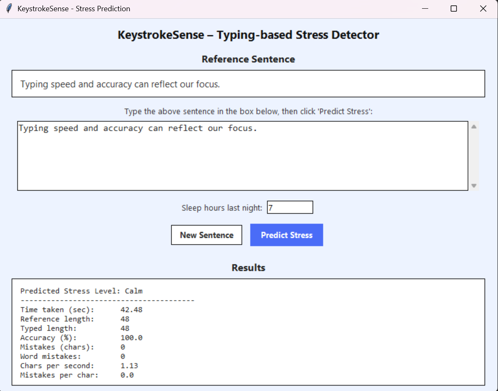
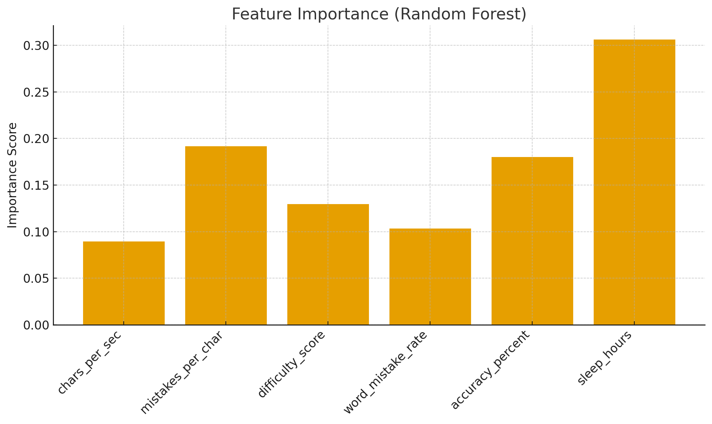

# KeystrokeSense  
### Typing-Based Stress Detection Using Machine Learning  
A Python + ML + Tkinter project for analyzing typing behavior to predict a user’s stress level.

---

## 📌 Overview  
KeystrokeSense is a machine learning project that predicts **stress level**—Calm, Normal, or Stressed—based on typing behavior patterns.

The system collects:
- Typing speed  
- Mistakes per character  
- Word-level errors  
- Accuracy %  
- Sleep hours  
- Text difficulty score  

ML algorithms analyze these features to classify stress.  
This project includes:
✔ Data collection script  
✔ Feature engineering  
✔ ML model training  
✔ Confusion matrix & graphs  
✔ Tkinter GUI for live stress prediction  
✔ Full GitHub project structure  

---

## 🎯 Key Features

### **1️⃣ Typing Data Logger** (`typing_logger.py`)
- Shows a random sentence.
- User types it.
- Script records:
  - Time taken  
  - Mistakes  
  - Accuracy  
  - Typed characters  
  - Sleep hours  
  - Stress label (self-reported)

Data saved into:

data/raw_sessions.csv
data/sessions_with_features.csv

yaml
Copy code

---

### **2️⃣ Feature Engineering**  
The following predictive features are computed:

| Feature | Meaning |
|--------|---------|
| chars_per_sec | Typing speed |
| mistakes_per_char | Character errors |
| word_mistake_rate | Word mismatch frequency |
| accuracy_percent | Total accuracy |
| difficulty_score | (Ref length – typed length) + mistakes |
| sleep_hours | User-reported sleep |

---

### **3️⃣ ML Models (Training)**  
Two models were trained:

- **Logistic Regression**
- **Random Forest (Best Model)**  
  📌 Final Accuracy: **~75%**

Confusion matrices + performance metrics were generated.

ML output model saved as:

models/stress_model.pkl

yaml
Copy code

---

### **4️⃣ Tkinter UI – Live Stress Prediction**  
A complete GUI built with Tkinter.

#### ✔ Features:
- Reference sentence display  
- Multiline typing box  
- Sleep hour input  
- “Predict Stress” button  
- Shows:
  - Predicted Stress  
  - Time taken  
  - Mistakes  
  - Accuracy  
  - Word error rate  
  - Characters/sec  
  - Difficulty score  

---

## 🖼 Tkinter UI Screenshots

### **Main Interface**


More screenshots can be added in `graphs/`.

---

## 📊 Analysis Graphs

Generated in the `graphs/` folder:

- `speed_vs_stress.png`
- `mistakes_vs_stress.png`
- `accuracy_vs_stress.png`
- `sleep_vs_stress.png`
- `feature_importance.png`

Example:

### **Feature Importance**


---

## 🧪 How to Run the Project

### **1️⃣ Install Dependencies**
```bash
pip install -r requirements.txt
(or install manually: pandas, scikit-learn, matplotlib)

2️⃣ Collect Typing Data
bash
Copy code
python -m src.typing_logger
3️⃣ Generate Features
bash
Copy code
python -m src.feature_engineering
4️⃣ Train ML Model
bash
Copy code
python -m src.train_model
5️⃣ Predict Stress from Manual Input
bash
Copy code
python -m src.predict_stress
6️⃣ Live Prediction (CLI)
bash
Copy code
python -m src.live_predict
7️⃣ Launch Tkinter UI
bash
Copy code
python -m src.tk_ui
📁 Project Structure
kotlin
Copy code
keystrokesense/
│
├── data/
│   ├── raw_sessions.csv
│   └── sessions_with_features.csv
│
├── graphs/
│   ├── speed_vs_stress.png
│   ├── mistakes_vs_stress.png
│   ├── accuracy_vs_stress.png
│   ├── sleep_vs_stress.png
│   ├── feature_importance.png
│   └── ui interface.png
│
├── models/
│   └── stress_model.pkl
│
├── src/
│   ├── typing_logger.py
│   ├── feature_engineering.py
│   ├── train_model.py
│   ├── predict_stress.py
│   ├── live_predict.py
│   ├── tk_ui.py
│   └── make_plots.py
│
├── README.md
└── requirements.txt
🛠 Technologies Used
Python

Tkinter (GUI)

Scikit-learn (ML models)

Pandas / Numpy (data processing)

Matplotlib (graphs)

GitHub (version control)

📌 Conclusion
KeystrokeSense demonstrates that typing patterns can reveal behavioral stress levels.
With only keystroke data + ML, the system achieves 75% accuracy and provides a full working UI for real-time prediction.

This project is ideal for:

ML beginners

Behavioral analytics

UI + ML integration practice

College academic submissions

🙌 Author
Chakshu Mehta
CSE - Data Science & AI
SRM Institute of Science and Technology
